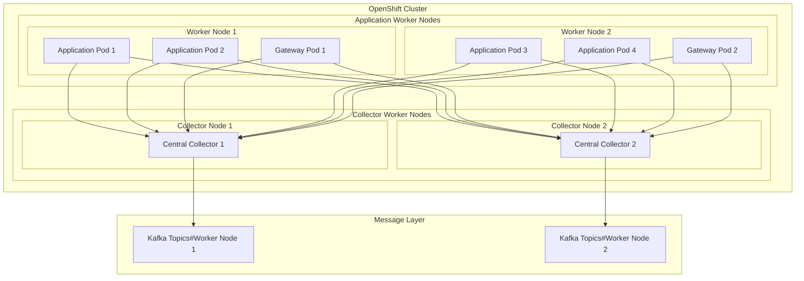

# Centralized Deployment Model

---
layout: default
---

# Centralized Architecture

---
layout: two-cols
---

# Centralized Advantages

- Efficient resource utilization
- Easier upgrades and configuration
- Better control over resources
- Simplified Kafka connection pool
- Easy collector redundancy
- Centralized monitoring

::right::

# Centralized Challenges

- Single point of failure risk
- Complex scaling requirements
- Higher cross-node network traffic
- Complex capacity planning
- Risk of collector overload

