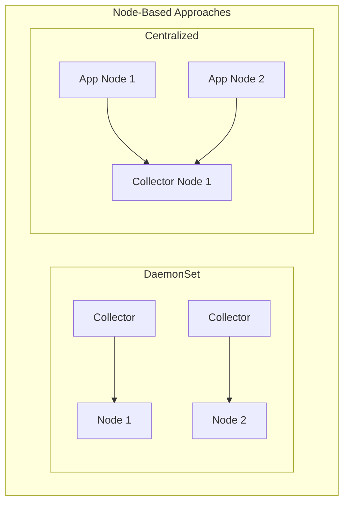
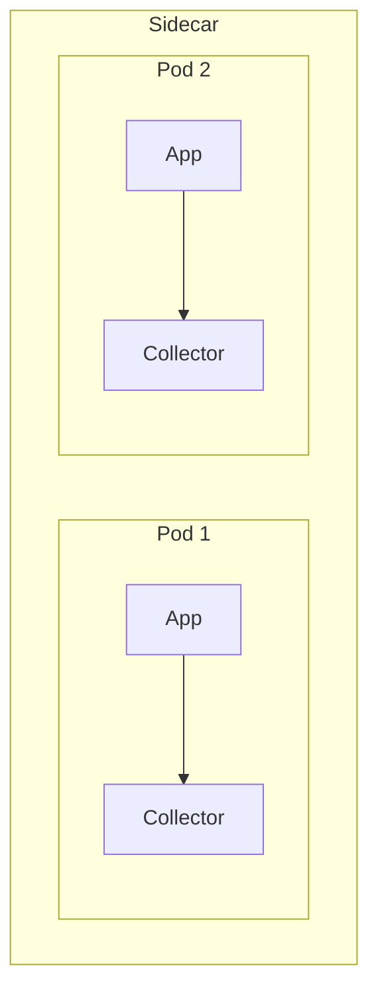
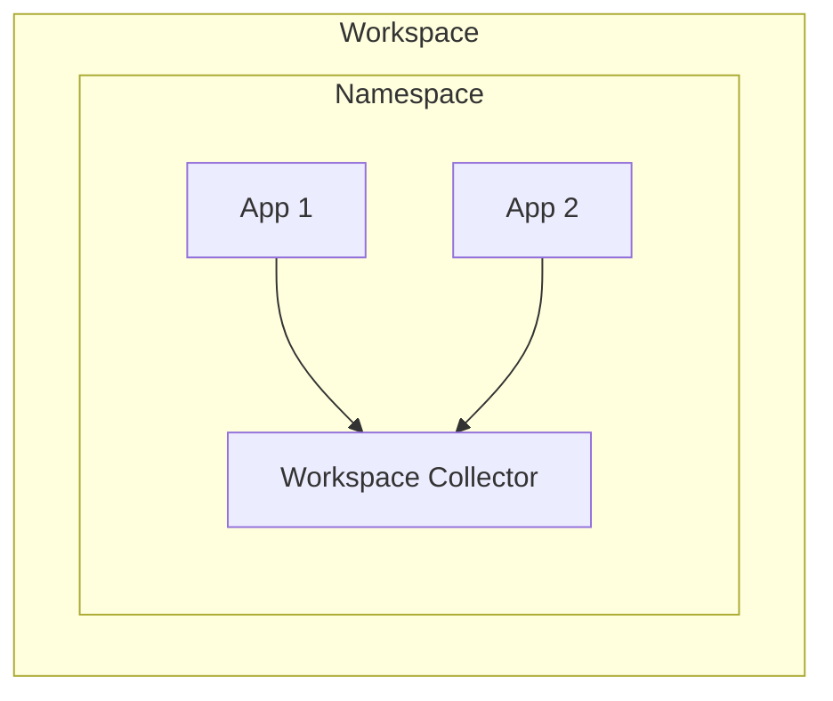
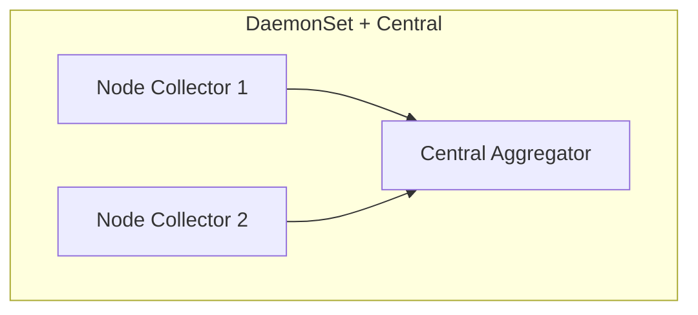
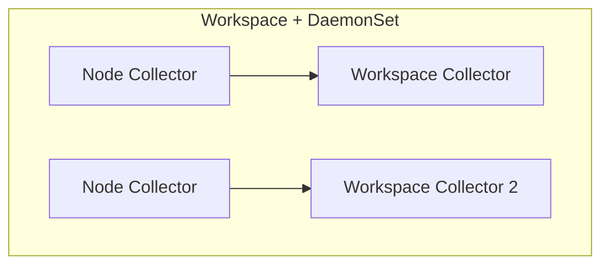

# Runtime Deployment Models Comparison

---
layout: default
---

# Node-Based Models Characteristics

## Common Traits
- Node-level resource management
- Cluster-wide deployment strategies
- Network optimization potential



---
layout: two-cols
---

# Pod-Based Models Characteristics

## Common Traits
- Pod-level isolation
- Direct application integration
- Fine-grained control

::right::





---
layout: two-cols
---

# Hybrid Approaches Characteristics

## Common Traits
- Multi-level data processing
- Flexible deployment options
- Combined benefits

::right::





---
layout: default
---

# Runtime Performance Comparison

|Aspect|Node-Based|Pod-Based|Hybrid|
|------|----------|---------|------|
|Network Efficiency|High|Medium|High|
|Resource Utilization|Efficient|Variable|Balanced|
|Scaling Complexity|Low|Medium|High|
|Data Processing Locality|Node-level|Pod-level|Multi-level|
|Maintenance Overhead|Low|High|Medium|

---
layout: two-cols
---

# Resource Impact By Model

Node-Based:
```yaml
DaemonSet:
  - Fixed per node
  - Predictable sizing
  - Node-level quotas

Centralized:
  - Concentrated resources
  - Efficient pooling
  - Dedicated nodes
```

::right::

<br>
<br>
<br>

Pod-Based:
```yaml
Sidecar:
  - Per-pod overhead
  - Linear scaling
  - Container resources

Workspace:
  - Namespace quotas
  - Independent scaling
  - Shared resources
```

---
layout: two-cols
---

# Best Practices by Model Type

## Node-Based Deployments
- Monitor node resources
- Plan node capacity
- Network optimization
- Node affinity rules

## Pod-Based Deployments
- Container resource limits
- Inter-pod communication
- Namespace quotas
- Pod affinity rules

::right::

<br>
<br>
<br>
<br>
<br>
<br>
<br>

## Hybrid Deployments
- Multi-level monitoring
- Tiered resource planning
- Cross-component optimization
- Complex affinity rules

---
layout: end
class: text-center
---

# Decision Framework

1. Start with Scale Analysis
2. Consider Isolation Requirements
3. Evaluate Operational Capacity
4. Choose Base Model
5. Consider Hybrid if Needed