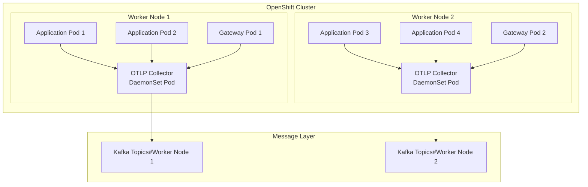

# DaemonSet Deployment Model

---
layout: default
---

# DaemonSet Architecture

---
layout: two-cols
---

# DaemonSet Advantages

- One collector per node
- Predictable resource allocation
- Simple capacity planning
- Better network efficiency
- Easy monitoring per node
- Simple configuration management

::right::

# DaemonSet Challenges

- Fixed overhead per node
- Less flexible scaling
- Need node resources regardless of load
- Node failure impacts collection
- All collectors update simultaneously

---
layout: default
---

# Maintenance Considerations

- Single DaemonSet manifest to maintain
- Rolling updates by OpenShift
- Uniform configuration across nodes
- Simple health monitoring
- Easy backup and recovery
- Automated pod placement

