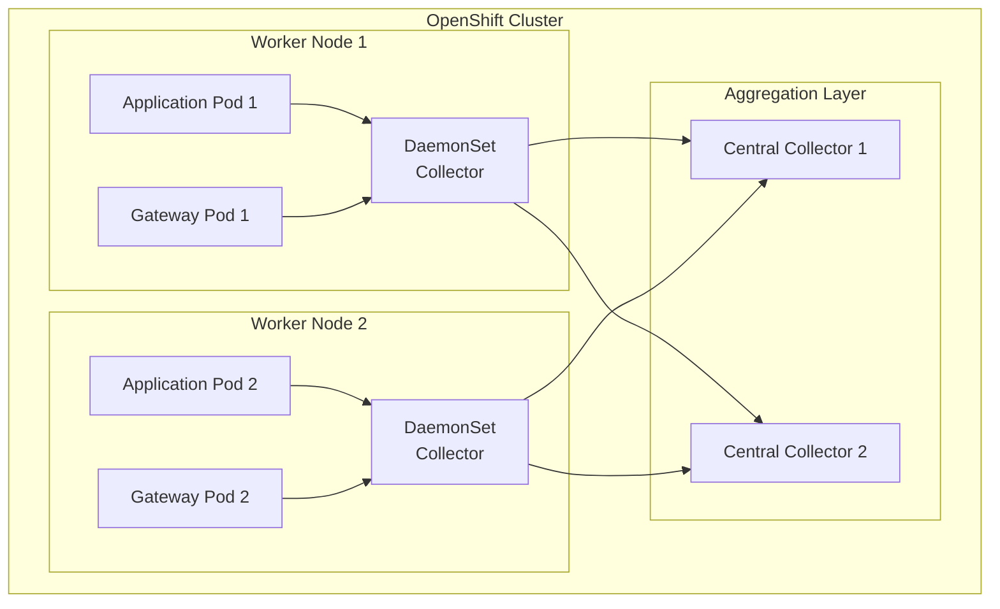

# Hybrid Deployment Model

---
layout: default
---

# Hybrid Architecture



---
layout: two-cols
---

# Hybrid Advantages

- Balanced efficiency
- Two-tier collection
- Better fault isolation
- Flexible updates
- Separate scaling layers
- Enhanced reliability

::right::

# Hybrid Challenges

- Complex initial setup
- Two collector types
- Complex troubleshooting
- Careful capacity planning
- Higher maintenance overhead

---
layout: default
---

# Component Configuration

DaemonSet Collectors:
```yaml {all|3-7|9-13}
resources:
  requests:
    cpu: "200m"
    memory: "256Mi"
  limits:
    cpu: "500m"
    memory: "512Mi"
```

Aggregation Collectors:
```yaml
resources:
  requests:
    cpu: "500m"
    memory: "512Mi"
  limits:
    cpu: "1000m"
    memory: "1Gi"
```

---
layout: two-cols
---

# Deployment Strategy

1. DaemonSet Layer:
   - One collector per node
   - Local data collection
   - Basic preprocessing

2. Aggregation Layer:
   - Load-balanced collectors
   - Data aggregation
   - Advanced processing
   - Kafka integration

::right::

<br>
<br>
<br>

3. Scaling Strategy:
   - Automatic node coverage
   - HPA for aggregation layer
