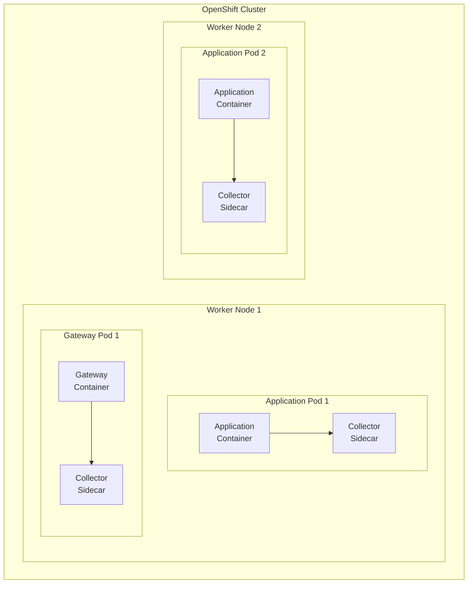

# Sidecar Deployment Model

---
layout: default
---

# Sidecar Architecture



---
layout: two-cols
---

# Sidecar Advantages

- High isolation
- Direct control per application
- Simple network security
- Independent scaling
- Enhanced reliability
- App-specific configuration

::right::

# Sidecar Challenges

- Massive resource overhead
- Complex configuration management
- High Kafka connection count
- Complex version control
- Heavy operational burden

---
layout: default
---

# Resource Impact

Current State (20% utilization):
- ~2,080 collector instances
- Resource usage per sidecar:
```yaml
resources:
  requests:
    cpu: "100m"
    memory: "128Mi"
  limits:
    cpu: "200m"
    memory: "256Mi"
```

Future State (80% utilization):
- ~8,320 collector instances
- Total resource consumption:
  - CPU: 832 cores (requested)
  - Memory: 1,040 GB (requested)

---
layout: default
---

# Implementation Example

```yaml
apiVersion: apps/v1
kind: Deployment
metadata:
  name: app-with-collector
spec:
  template:
    spec:
      containers:
      - name: application
        image: app-image:latest
      - name: collector-sidecar
        image: otel/opentelemetry-collector:latest
        volumeMounts:
        - name: collector-config
          mountPath: /conf
      volumes:
      - name: collector-config
        configMap:
          name: collector-config
```
