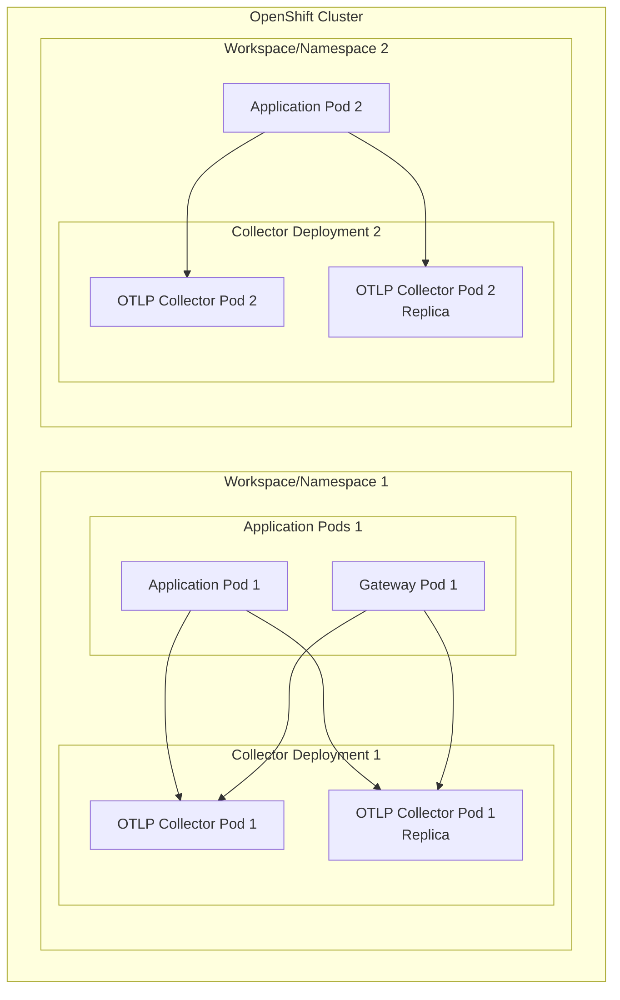

# Workspace-Scoped Deployment Model

---
layout: default
---

# Workspace Architecture



---
layout: two-cols
---

# Workspace Advantages

- Complete namespace isolation
- Independent scaling
- Team-specific configurations
- Separate service accounts
- Better multi-tenant support
- Independent maintenance

::right::

# Workspace Challenges

- More configurations
- Higher resource usage
- Multiple Kafka connections
- Complex monitoring setup
- Coordination across teams

---
layout: default
---

# RBAC Configuration

```yaml
apiVersion: rbac.authorization.k8s.io/v1
kind: Role
metadata:
  name: collector-role
  namespace: ${WORKSPACE_NAME}
rules:
  - apiGroups: [""]
    resources: ["pods", "configmaps"]
    verbs: ["get", "list", "watch"]
  - apiGroups: ["apps"]
    resources: ["deployments"]
    verbs: ["get", "list", "watch"]
```

---
layout: default
---

# Network Policies

```yaml
apiVersion: networking.k8s.io/v1
kind: NetworkPolicy
metadata:
  name: collector-policy
  namespace: ${WORKSPACE_NAME}
spec:
  podSelector:
    matchLabels:
      app: otlp-collector
  policyTypes:
  - Ingress
  - Egress
  ingress:
  - from:
    - namespaceSelector:
        matchLabels:
          name: ${WORKSPACE_NAME}
```
